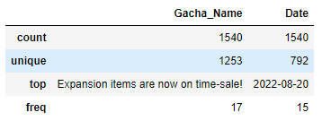
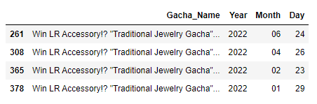

Alchemia Story Gacha Analysis - Overview
========================================
- Scraped Data from Alchemia Story Website
- Analyzed the events data

Installation
------------
Following will be required to use the project:
- **Python version:** 3.10   
- **Packages:** numpy, pandas, matplotlib, seaborn, sklearn, bs4, os   

**Data Source:** https://en.alchemiastory.jp/information/?page=1&type_code=notice

Usage
-----
- This can be used to find the information about the Alchemia Story gacha.
- To implement Application that can give the information about last appearance of a gacha banner.

Project Structure
-----------------

    ├── LICENSE
    ├── README.md          <- The top-level README for developers using this project.
    ├── data
    │   ├── external       <- Data from third party sources.
    │   ├── interim        <- Intermediate data that has been transformed.
    │   ├── processed      <- The final, canonical data sets for modeling.
    │   └── raw            <- The original, immutable data dump.
    │
    │
    ├── models             <- Trained and serialized models, model predictions, or model summaries
    │
    ├── notebooks          <- Jupyter notebooks. Naming convention is a number (for ordering),
    │                         the creator's initials, and a short `-` delimited description, e.g.
    │                         `1.0-jqp-initial-data-exploration`.
    │
    └── reports            <- Generated analysis as HTML, PDF, LaTeX, etc.
        └── figures        <- Generated graphics and figures to be used in reporting

Web Scraping
------------
I used Beautiful Library to scrape the data from Alchemia Story Offical Website.    
I scaraped all pages there and saved the data in a csv file.

Data Information
----------------
The data had the following columns:   
- Gacha_Name
- Date

Exploratory Data Analysis 
-------------------------
I looked at the distributions of the data. Here are the few highlights from the analysis:

- Separated the Date column into Day, Month and Year.
- There were too many unique values.
- Most of the gacha banners appeared only one time in the data even though the gacha banners were repeated many times.
- Only last instance of gacha banner is saved on the website it seems.
- This data can be used to easily find the last time a gacha banner appeared.

License
-------
Copyright (c) 2022 Hamza-Farrukh   
This project is [MIT](LICENCE "LICENSE") licensed.
